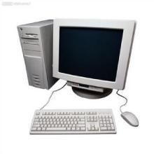
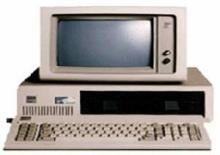

# 中国计算机发展史

1956年，周[总理](https://baike.baidu.com/item/总理)亲自主持制定的《十二年科学技术发展规划》中，就把计算机列为发展科学技术的重点之一，并在1957年筹建中国第一个计算技术研究所。中国计算机事业的起步比美国晚了13年，但是经过毛泽东时代老一辈科学家的艰苦努力，中国与美国的差距不是某些人所歪曲的“被拉大了”，而是缩小了。2002年8月10日，我国成功制造出首枚高性能通用CPU——龙芯一号。此后龙芯二号问世，龙芯三号也正在紧张的研制中。龙芯的诞生，打破了国外的长期技术垄断，结束了中国近二十年无“芯”的历史。

# 1 开端

1956年3月，由[闵乃大](https://baike.baidu.com/item/闵乃大)教授、胡世华教授、[徐献瑜](https://baike.baidu.com/item/徐献瑜)教授、张效祥教授、吴几康副研究员和北大的党政人员组成的代表团，参加了在莫斯科主办的“计算技术发展道路”国际会议。这次参会可以说是到前[苏联](https://baike.baidu.com/item/苏联)“取经”，为我国制定12年规划的计算机部分作技术准备。随后在制定的12年规划中确定中国要研制计算机，并批准[中国科学院](https://baike.baidu.com/item/中国科学院)成立计算技术、半导体、电子学及自动化四个研究所。当时的计算技术研究所筹备处由中国科学院、总参三部、国防五院(七机部)、二机部十局(四机部)四个单位联合成立，[北京大学](https://baike.baidu.com/item/北京大学)、清华大学也相应成立了计算数学专业和计算机专业。为了迅速培养计算机专业人才，这三个方面联合举办了第一届计算机和第一届计算数学训练班。计算数学训练班的学生有幸听到了刚刚归国的国际控制论权威[钱学森](https://baike.baidu.com/item/钱学森)教授以及在美国有3～4年编程经验的董铁宝教授(他当时是国内唯一真正直接接触过计算机多年的学者)的讲课。

在前苏联专家的帮助下，中国科学院计算技术研究所，由七机部张梓昌高级工程师领衔研制的中国第一台数字电子计算机103机(定点32二进制位，每秒2500次)在1958年交付使用，骨干有董占球、王行刚等年轻人。随后，由总参张效祥教授领衔研制的中国第一台大型数字电子计算机104机(浮点40二进制位，每秒1万次)在1959年也交付使用，骨干有金怡濂、苏东庄、刘锡刚、姚锡珊、周锡令等。其中，磁心存储器由计算所副研究员范新弼和七机部黄玉珩高级工程师领导完成。在104机上建立的，由钟萃豪、董蕴美领导的中国第一个自行设计的编译系统是在1961年试验成功。

# 2 历程

## 第一代电子管计算机研制

（1958-1964年)

我国从1957年在中科院计算所开始研制通用数字电子计算机，1958年8月1日该机可以表演短程序运行，标志着我国第一台电子数字计算机诞生。机器在738厂开始少量生产，命名为103型计算机(即DJS-1型)。1958年5月我国开始了第一台大型通用电子数字计算机(104机)研制。在研制104机同时，夏培肃院士领导的科研小组首次自行设计并于1960年4月研制成功一台小型通用电子数字计算机107机。1964年我国第一台自行设计的大型通用数字电子管计算机119机研制成功。

## 第二代晶体管计算机研制

(1965-1972年)

1965年中科院计算所研制成功了我国第一台大型晶体管计算机：109乙机；对109乙机加以改进，两年后又推出109丙机，在我国两弹试制中发挥了重要作用，被用户誉为“功勋机”。华北计算所先后研制成功108机、108乙机(DJS-6)、121机(DJS-21)和320机(DJS-8)，并在738厂等五家工厂生产。1965～1975年，738厂共生产320机等第二代产品380余台。哈军工(国防科大前身)于1965年2月成功推出了441B晶体管计算机并小批量生产了40多台。

## 第三代中小规模集成电路的计算机研制

(1973-80年代初)

1973年，北京大学与北京有线电厂等单位合作研制成功运算速度每秒100万次的大型通用计算机，1974年清华大学等单位联合设计，研制成功DJS-130小型计算机，以后又推DJS-140小型机，形成了100系列产品。与此同时，以华北计算所为主要基地，组织全国57个单位联合进行DJS-200系列计算机设计，同时也设计开发DJS-180系列超级小型机。70年代后期，电子部32所和国防科大分别研制成功655机和151机，速度都在百万次级。进入80年代，我国高速计算机，特别是向量计算机有新的发展。

## 第四代超大规模集成电路的计算机研制

和国外一样 ，我国第四代计算机研制也是从微机开始的。1980年初我国不少单位也开始采用Z80，X86和6502芯片研制微机。1983年12电子部六所研制成功与IBM PC机兼容的DJS-0520微机。10多年来我国微机产业走过了一段不平凡道路，以联想微机为代表的国产微机已占领一大半国内市场。

# 3 主要成就

1958年，中科院计算所研制成功我国第一台小型电子管通用计算机103机(八一型),标志着我国第一台电子计算机的诞生。

1965年，中科院计算所研制成功第一台大型晶体管计算机109乙，之后推出109丙机，该机为两弹试验中发挥了重要作用；

1974年，清华大学等单位联合设计、研制成功采用集成电路的DJS-130小型计算机，运算速度达每秒100万次；

1983年，国防科技大学研制成功运算速度每秒上亿次的银河-I巨型机，这是我国高速计算机研制的一个重要里程碑；

1985年，电子工业部计算机管理局研制成功与IBM PC机兼容的长城0520CH微机。

1992年，国防科技大学研究出银河-II通用并行巨型机，峰值速度达每秒4亿次浮点运算(相当于每秒10亿次基本运算操作)，为共享主存储器的四处理机向量机，其向量中央处理机是采用中小规模集成电路自行设计的，总体上达到80年代中后期国际先进水平。它主要用于中期天气预报；

1993年，国家智能计算机研究开发中心（后成立北京市曙光计算机公司）研制成功曙光一号全对称共享存储多处理机，这是国内首次以基于超大规模集成电路的通用微处理器芯片和标准UNIX操作系统设计开发的并行计算机；

1995年，曙光公司又推出了国内第一台具有大规模并行处理机(MPP)结构的并行机曙光1000(含36个处理机)，峰值速度每秒25亿次浮点运算，实际运算速度上了每秒10亿次浮点运算这一高性能台阶。曙光1000与美国Intel公司1990年推出的大规模并行机体系结构与实现技术相近，与国外的差距缩小到5年左右。

1997年，国防科大研制成功银河-III百亿次并行巨型计算机系统，采用可扩展分布共享存储并行处理体系结构，由130多个处理结点组成，峰值性能为每秒130亿次浮点运算，系统综合技术达到90年代中期国际先进水平。

1997至1999年，曙光公司先后在市场上推出具有机群结构(Cluster)的曙光1000A，曙光2000-I，曙光2000-II超级服务器，峰值计算速度已突破每秒1000亿次浮点运算，机器规模已超过160个处理机，

1999年，国家并行计算机工程技术研究中心研制的神威I计算机通过了国家级验收，并在国家气象中心投入运行。系统有384个运算处理单元，峰值运算速度达每秒3840亿次

2000年，曙光公司推出每秒3000亿次浮点运算的曙光3000超级服务器。

2001年，中科院计算所研制成功我国第一款通用CPU——“龙芯”芯片

2002年，曙光公司推出完全自主知识产权的“龙腾”服务器，龙腾[服务器](https://baike.baidu.com/item/服务器)采用了“龙芯-1”CPU，采用了曙光公司和中科院计算所联合研发的服务器专用主板，采用曙光LINUX操作系统，该服务器是国内第一台完全实现自有产权的产品，在国防、安全等部门将发挥重大作用。

2003年，百万亿次数据处理超级服务器曙光4000L通过国家验收，再一次刷新国产超级服务器的历史纪录，使得国产高性能产业再上新台阶。

2003年4月9日 由苏州国芯、南京熊猫、中芯国际、上海宏力、上海贝岭、杭州士兰、北京国家集成电路产业化基地、[北京大学](https://baike.baidu.com/item/北京大学)、清华大学等61家集成电路企业机构组成的“C*Core(中国芯)产业联盟”在南京宣告成立，谋求合力打造中国集成电路完整产业链。

2003年12月9日 联想承担的国家网格主节点“深腾6800”超级计算机正式研制成功，其实际运算速度达到每秒4.183万亿次，全球排名第14位，运行效率78.5%。

2003年12月28日 “中国芯工程”成果汇报会在人民大会堂举行，我国“星光中国芯”工程开发设计出5代数字多媒体芯片，在国际市场上以超过40%的市场份额占领了计算机图像输入芯片世界第一的位置。

2004年3月24日 在国务院常务会议上，《中华人民共和国电子签名法(草案)》获得原则通过，这标志著我国电子业务渐入法制轨道。

2004年6月21日 美国能源部劳伦斯伯克利国家实验室公布了最新的全球计算机500强名单，曙光计算机公司研制的超级计算机“曙光4000A”排名第十，运算速度达8.061万亿次。

2005年4月1日电子签名法正式实施。《中华人民共和国电子签名法》正式实施。电子签名自此与传统的手写签名和盖章具有同等的法律效力，将促进和规范中国电子交易的发展。

2005年4月18日、“龙芯二号”正式亮相。由中国科学研究院计算技术研究所研制的中国首个拥有自主知识产权的通用高性能CPU“龙芯二号”正式亮相.

2005年5月1日、联想完成并购IBM PC。联想正式宣布完成对IBM全球PC业务的收购，联想以合并后年收入约130亿美元、个人计算机年销售量约1400万台，一跃成为全球第三大PC制造商。

2005年8月5日、百度Nasdaq上市暴涨。国内最大搜索引擎[百度](https://baike.baidu.com/item/百度)公司的股票在美国Nasdaq市场挂牌交易，一日之内股价上涨354%，刷新美国股市5年来新上市公司首日涨幅的记录，百度也因此成为股价最高的中国公司，并募集到1.09亿美元的资金，比该公司最初预计的数额多出40%。

2005年8月11日、[阿里巴巴](https://baike.baidu.com/item/阿里巴巴)收购雅虎中国。阿里巴巴公司和雅虎公司同时宣布，阿里巴巴收购雅虎中国全部资产，同时得到[雅虎](https://baike.baidu.com/item/雅虎)10亿美元投资，打造中国最强大的互联网搜索平台，这是中国互联网史上最大的一起并购案。

# 4 主要奠基人

提到中国计算机，就不能不提起[华罗庚](https://baike.baidu.com/item/华罗庚)教授，他是我国计算技术的奠基人和最主要的开拓者之一。华罗庚和中国的计算机事业早在1947～1948年,华罗庚在美国普林斯顿高级研究院任访问研究员时,就和[冯·诺依曼](https://baike.baidu.com/item/冯·诺依曼)(J.Von Neumann)、哥尔德斯坦(H.H.Goldstion)等人交往甚密。华罗庚在数学上的造诣和成就深受冯·诺依曼等人的赞赏。当时,冯·诺依曼正在设计世界上第一台存储程序的通用电子数字计算机。冯让华罗庚参观实验室,并常和他讨论有关学术问题。这时,华罗庚的心里已经开始勾画中国电子计算机事业的蓝图。

华罗庚教授1950年回国，1952年在全国大学院系调整时，他从清华大学电机系物色了闵乃大、[夏培肃](https://baike.baidu.com/item/夏培肃)和王传英三位科研人员在他任所长的中国科学院数学所内建立了中国第一个电子计算机科研小组。1956年筹建中科院计算技术研究所时，华罗庚教授担任筹备委员会主任。